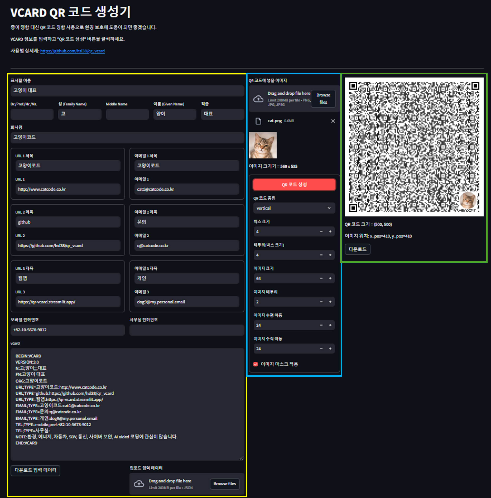
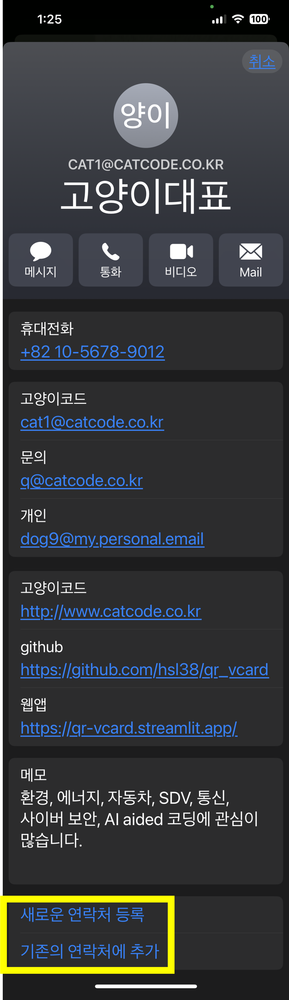
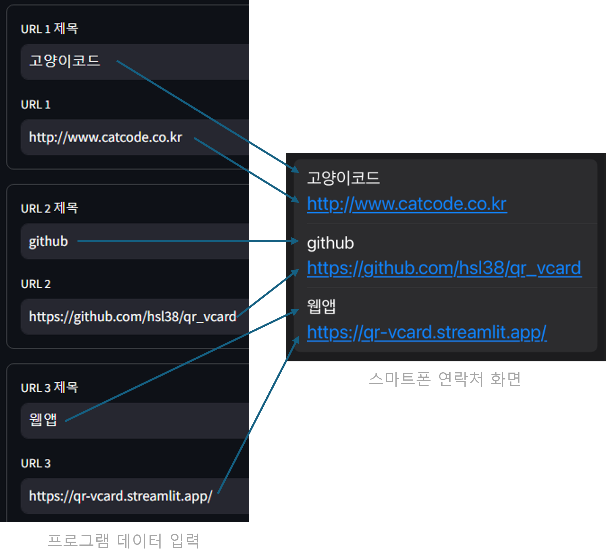
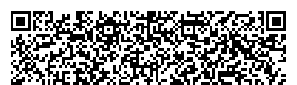
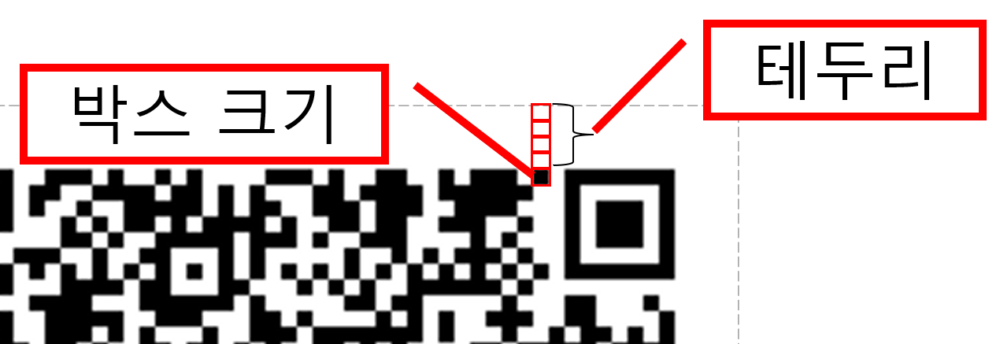
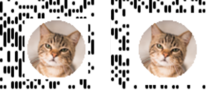
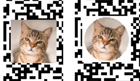

# qr_vcard.py
- 
- 종이 명함 대신 QR 코드 명함 사용으로 환경 보호에 도움이 되면 좋겠습니다.


## 프로그램 화면 



## QR 코드 명함 사용하기
- 만들기 --> 건네기 --> 받기

### QR 코드 명함 만들기
- qr_vcard 프로그램 화면에서 명함에 넣을 데이터를 입력한 후, "QR 코드 생성" 버튼을 클릭하면, QR 코드 명함 이미지가 생성됩니다. 
- "다운로드 QR 코드 이미지" 버튼을 클릭하여 QR 코드 명함을 다운로드합니다.
- 아래에서 상세히 설명합니다. 

### QR 코드 명함 건네기
- 명함을 건네야 할 때에 상대가 스캔할 수 있도록 스마트폰 화면에 QR 코드 명함을 띄워주세요.

### QR 코드 명함 받기
- 스마트폰 카메라로 QR 코드를 스캔하면 아래 그림의 노란색 "고양이대표" 처럼 명함 이름 링크가 뜹니다.
    - 
- 링크를 터치하면 아래 그림들처럼 데이터가 입력된 상태로 스마트폰의 연락처 앱이 열립니다.
    - 
- "새로운 연락처 등록" 혹은 "기존의 연락처에 추가"를 터치하여 명함을 연락처에 저장합니다.


## 명함 데이터 입력
- qr_vcard 프로그램 화면 그림에서 노란색 테두리친 부분에 관한 설명입니다. 
- 표시할 이름: 연락처 앱에 표시될 이름 (명함 이름)
- 이름
    - Dr./Prof./Mr./Ms.: 이름 앞에 붙일 칭호
    - 성(Family Name): 성
    - Middle Name: 가운데 이름
    - 이름(Given Name): 이름
    - 직급: 직급, 경칭
- 회사명: 회사 이름
- URL
    - URL은 제목 입력과 URL 입력으로 구성됩니다.
    - 데이터 입력과 연락처 앱 화면 표시 관계는 아래 그림과 같습니다.
    - 
    - URL 제목을 입력하지 않으면 연락처 앱에 URL이라고 뜹니다.
- 이메일
    - URL과 같은 방식입니다.
- 모바일 전화번호: 모바일 전화번호
- 사무실 전화번호: 사무실 전화번호
- 노트: 노트. [주의] 줄바꿈(엔터키 입력)을 하면 첫 줄만 QR 코드에 포함됩니다. 
- vcard
    - 위에서 입력한 데이터들이 스마트폰의 연락처 앱에서 읽을 수 있는 vcard 형식에 따라 표시됩니다.
    - vcard의 내용을 편집할 수 있습니다. 
    - 예> 이메일 추가
        - 변경 전   
            
        ```text
        EMAIL;TYPE=고양이코드:cat1@catcode.co.kr
        EMAIL;TYPE=문의:q@catcode.co.kr
        EMAIL;TYPE=개인:dog9@my.personal.email
        ```
        - 변경 후 
        ```text
        EMAIL;TYPE=고양이코드:cat1@catcode.co.kr
        EMAIL;TYPE=문의:q@catcode.co.kr
        EMAIL;TYPE=개인1:dog9@my.personal.email
        EMAIL;TYPE=개인2:dog99@my.personal.email
        ```
- "다운로드 입력 데이터" 버튼
    - 입력한 데이터를 재사용할 경우를 대비하여, 데이터를 json 파일로 다운로드 할 수 있습니다. 
    - 버튼을 클릭하면 인터넷 브라우저의 다운로드 팝-업이 뜹니다.
- "업로드 입력 데이터"
    - 다운로드한 json 파일을 업로드하여 데이터 입력을 할 수 있습니다. 
    - 파일을 드래그&드롭하거나 "Browse files" 버튼을 클릭한 후 파일을 선택합니다.
    - **[주의]** "QR 코드 생성" 버튼을 클릭하면 입력한 데이터가 화면에 표시됩니다.  


## QR 코드 설정
- qr_vcard 프로그램 화면 그림에서 파란색 테두리친 부분에 관한 설명입니다. 
- 명함에 이미지를 넣고 싶을 경우, "QR 코드에 넣을 이미지"에 이미지 파일을 드래그&드롭하거나 "Browse files" 버튼을 클릭한 후 파일을 선택합니다.
- QR 코드 종류
    - virtical
        - 
    - rounded square
        - 
    - standard
        - 
- 박스 크기: QR 코드 점의 크기. 픽셀 단위 
- QR 코드 테두리[박스 크기]: QR 코드 테두리 두께. 단위는 박스입니다. 박스 크기가 4이고 테두리가 4이면 테두리 두께는 4 x 4 = 16 픽셀입니다.
    - 
- 이미지를 넣는 경우,
    - 이미지 크기: QR 코드 안에 이미지의 크기. 이미지가 너무 크면 QR 코드가 읽히지 않습니다.
    - 이미지 테두리: 이미지를 둘러싼 테두리의 두께
        - 왼쪽: 이미 테두리=2, 오른쪽: 이미지 테두리=8  
        - 
    - 이미지 수평 이동: 0일 때 오른쪽 끝에 이미지가 표시됩니다. 값이 커지면 이미지는 왼쪽으로 이동됩니다.
    - 이미지 수직 이동: 0일 때 아래쪽 끝에 이미지가 표시됩니다. 값이 커지면 이미지는 위쪽으로 이동됩니다.
    - 수평 이동: 24, 수직 이동: 24
        - 
    - 수평 이동: 280, 수직 이동: 168
        - 
    - 이미지 마스크 적용
        - 원형 마스트 적용을 선택합니다. 
        - 왼쪽: 마스크 미적용, 오른쪽: 마스크 적용
        - 


## QR 코드 생성
- qr_vcard 프로그램 화면 그림에서 녹색 테두리친 부분에 관한 설명입니다. 
- QR 코드 생성 버튼을 클릭하면 QR 코드가 생성됩니다.
- "다운로드" 버튼을 클릭하여 QR 코드 이미지 파일을 다운로드 받습니다. 버튼을 클릭하면 인터넷 브라우저의 다운로드 팝-업이 뜹니다.

## 팁
- 다양한 내용/언어로 명함을 만들어 사용해 보십시오.

## 개인 정보 보호
- 데이터는 프로그램 작동 중 메모리에만 보관됩니다. 
- [중요] 프로그램 사용을 마친 후 브라우저의 "새로 고침" 버튼을 클릭하면 데이터를 초기화 하십시오.   

